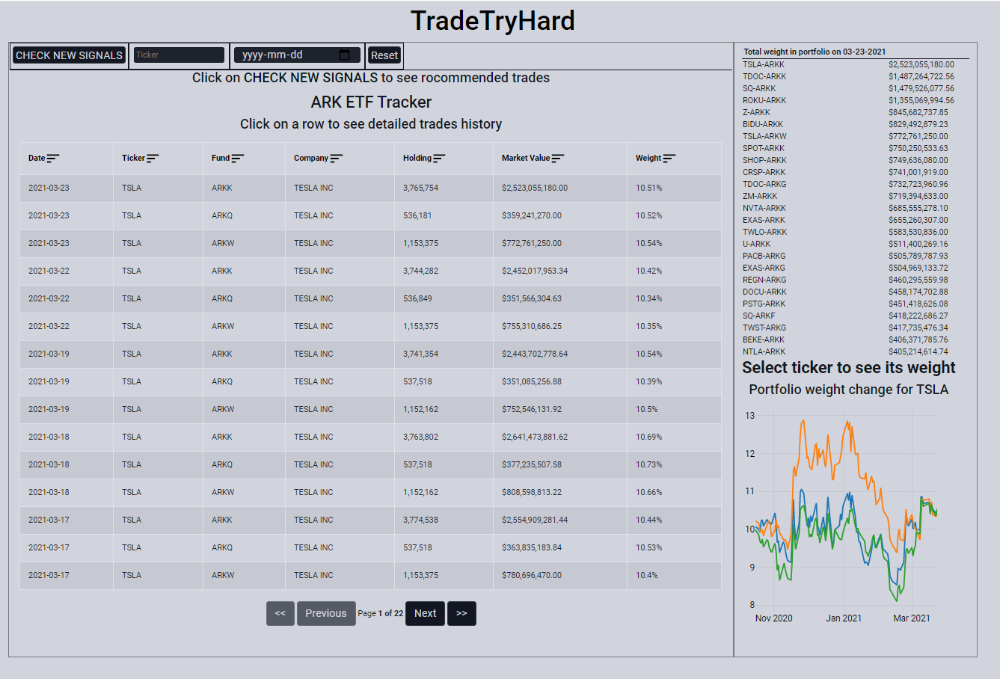
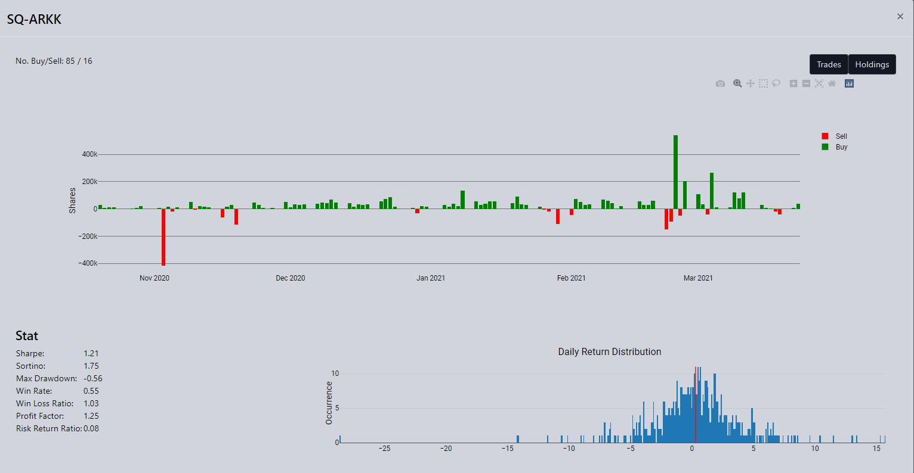
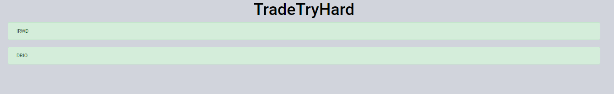
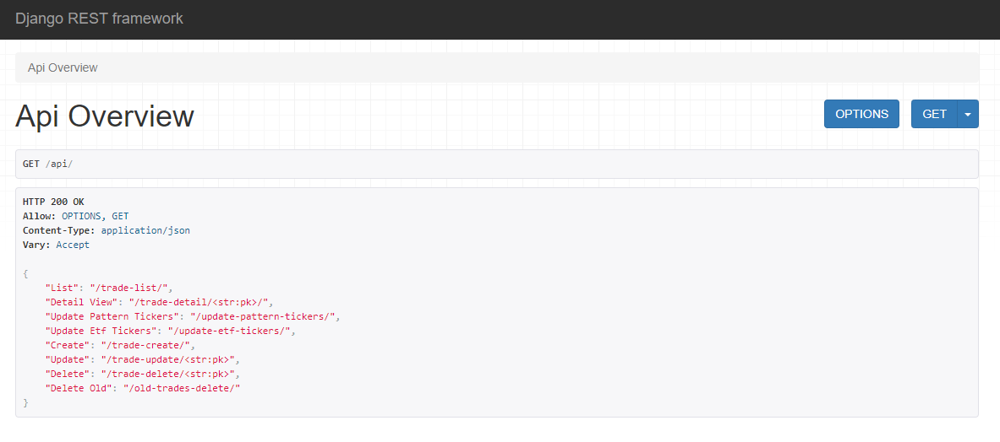

# FinViz Patterns Signals and ARK ETF Trackes

Project for choosing the best signals to buy or sell a stock from FinViz using [repository](https://github.com/MelnNik/FinViz-patterns).
Also, the app represents daily changes in the ARK's portfolio and showcases the best signals from it.
On the backend a scheduler runs every period of time and updates all the new signals, also, it's possible to update the data just with the request to API.
Frontend displays that signals and weight of stocks in ARK's portfolio on a daily basis.

## 💡 Stack

Django REST for [backend](https://tradetryhard-backend.herokuapp.com/api/) + [MongoDB Atlas](https://www.mongodb.com/cloud/atlas)

ReactJS For [inital Frontend](https://github.com/lit26/Ark_Trade_Tracker) by [@lit26](https://github.com/lit26)

## 💻 Demo

## 🔗 Links

[Backend Available Here](https://tradetryhard-backend.herokuapp.com/api/)  

[Frontend Available Here](https://tradetryhard-backend.web.app)  

[FinViz Patterns Parser](https://github.com/MelnNik/FinViz-patterns)  

[Inital Frontend](https://github.com/lit26/Ark_Trade_Tracker) by [@lit26](https://github.com/lit26)
